<div align="center">

[](https://github.com/Karan-g-2003)

[](https://git.io/typing-svg)

<br/>

[](https://www.linkedin.com/in/karanghuwalewala)
[](https://github.com/Karan-g-2003)
[](https://github.com/Karan-g-2003)

</div>

---

### 🧑‍💻 &nbsp;About Me

```python
class KaranGhuwalewala:
    name       = "Karan Ghuwalewala"
    university = "VIT Chennai — ECM (2026)"
    focus      = ["JavaScript Full-Stack", "ML/DL", "Cybersecurity"]
    current    = "Hybrid NIDS with Explainable AI (SHAP)"
    learning   = ["Spring Boot Microservices", "Cloud Architecture"]
    languages  = ["JavaScript", "Python", "Java", "C++"]
    ask_me     = "About IDS, REST APIs, or Agentic AI 🧩"
    fun_fact   = "Git stores your code as cryptographic objects, not files."
```

## Projects

<div align="center">

| Project | Description | Tech Stack | Repository |
|--------|-------------|------------|------------|
| **Roastfolio** | AI-powered portfolio analyzer that roasts developer portfolios and provides automated feedback on design, structure, and content. | `Next.js` `AI` `LLM` `Web Scraping` | [View](https://github.com/Karan-g-2003/RoastFolio) |
| **Movie Vault AI** | AI-powered movie recommendation engine that suggests movies based on user preferences and viewing patterns. | `JavaScript` `Machine Learning` | [View](https://github.com/Karan-g-2003/The-Great-Movie-Vault) |
| **SMS Spam Detector** | Machine learning model for detecting spam SMS messages using natural language processing techniques. | `Python` `Scikit-learn` `NLP` | [View](https://github.com/Karan-g-2003/SMS-Spam-Detection) |
| **IoT Climate Dashboard** | Real-time IoT monitoring system for environmental data with live dashboards and device integration. | `Django` `MongoDB` `ESP8266` `Chart.js` | [View](https://github.com/Karan-g-2003/iot_dashboard) |

</div>

---

### 🛡️ &nbsp;Current Project — Hybrid NIDS

<table>
<tr>
<td width="60%">

**[🔬 Hybrid Network Intrusion Detection System](https://github.com/Karan-g-2003/hybrid-intrusion-detection-xai)**

A capstone deep learning system trained on **CICIDS2017** that detects network anomalies with machine-grade precision. Built to see what humans miss — and explain every decision it makes.

| Component | Technology |
|---|---|
| Feature Extractor | Dense → Bi-LSTM → Multi-Head Attention |
| Classifier | XGBoost |
| Explainability | **SHAP** (key innovation) |


</td>
<td width="40%" align="center">

```
📦 Architecture
├── Dense Layer (feature extraction)
├── Bi-LSTM (temporal patterns)
├── Multi-Head Attention (focus)
├── XGBoost Classifier
└── SHAP Explainer ← ✨ innovation
    ├── Feature importance plots
    ├── SHAP waterfall charts
    └── Force plots per prediction
```

</td>
</tr>
</table>

---

### 🛠️ &nbsp;Tech Stack

<div align="center">

**Backend & APIs**

[](https://developer.mozilla.org/en-US/docs/Web/JavaScript) &nbsp;
[](https://nodejs.org) &nbsp;
[](https://java.com) &nbsp;
[](https://spring.io) &nbsp;
[](https://python.org) &nbsp;
[](https://djangoproject.com) &nbsp;
[](https://fastapi.tiangolo.com)

**Frontend**

[](https://reactjs.org) &nbsp;
[](https://developer.mozilla.org/en-US/docs/Web/HTML) &nbsp;
[](https://developer.mozilla.org/en-US/docs/Web/CSS) &nbsp;
[](https://getbootstrap.com)

**AI / ML**

[](https://tensorflow.org) &nbsp;
[](https://pytorch.org) &nbsp;
[](https://scikit-learn.org)


**Databases & DevOps**

[](https://mongodb.com) &nbsp;
[](https://mysql.com) &nbsp;
[](https://git-scm.com) &nbsp;
[](https://linux.org) &nbsp;
[](https://code.visualstudio.com) &nbsp;
[](https://docker.com)

</div>

---

### 📊 &nbsp;GitHub Analytics

<div align="center">


</div>

<div align="center">

[](https://git.io/streak-stats)

</div>

---

### 🏆 &nbsp;GitHub Trophies

<div align="center">

[](https://github.com/ryo-ma/github-profile-trophy)

</div>

---

<div align="center">



</div>
